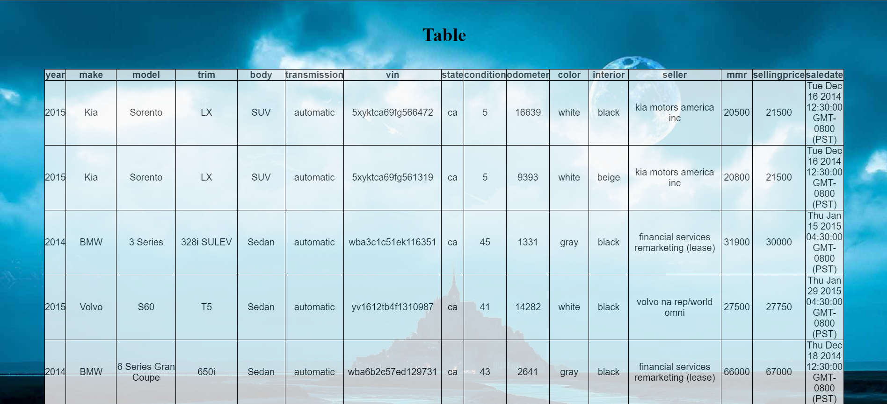

<pre><h1>                   CSV to HTML Table</h1></pre>

 
This is a Program that takes a CSV file as input, by upload and then prints it in the html webpage.
  
This was made using Python ,Flask(Python) ,HTML ,CSS.
 
 

Requirements:  
Download python along with pip3 and add it to the environment variables then   
Go open the command prompt and then write
  
<pre>>>pip3 install flask</pre>

<pre><h1>                      ScreenShots</h1></pre>

